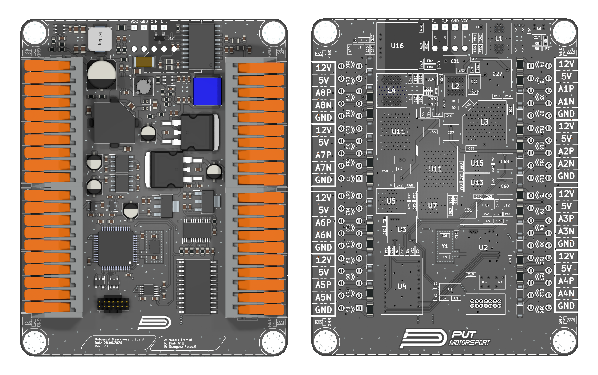

# Universal Measurement Board v2.0

  

---

# Changes

Revision 2.0 has the same functionality as v1.1 but has been reduced in size to meet the 10×10 cm production constraints required by the manufacturer.

# Description

UMB (Universal Measurement Board) is a project designed as multi-channel analog input device to allow various types of electrical measurements.
It provides 8 channels that can be used either as differential or single-ended measurement inputs. All signals are routed through an analog multiplexer, a programmable gain amplifier and an external ADC. Measurements are acquired by a microcontroller and transmitted via an FDCAN interface to a host device for further processing.